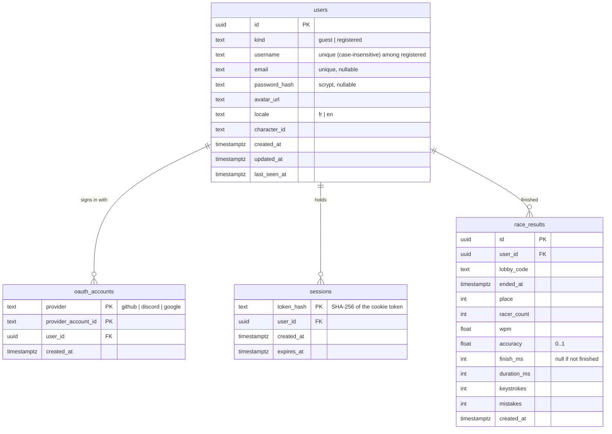
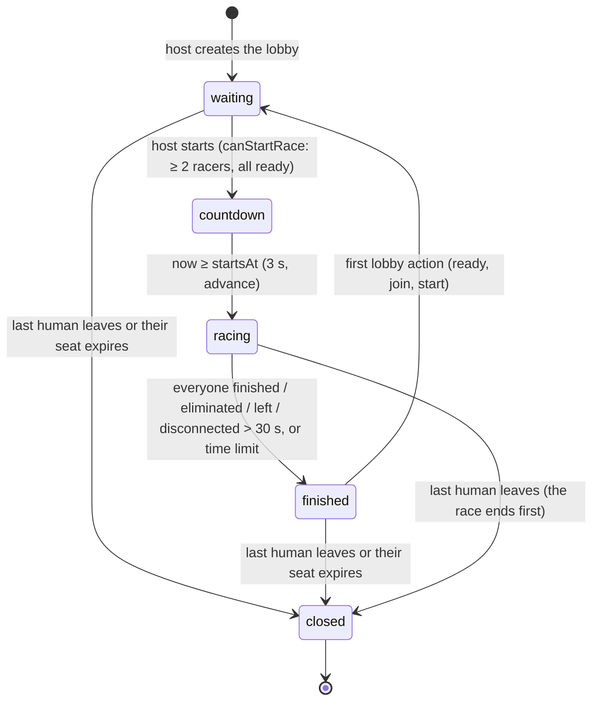

# Architecture

## Folder layout

```
src/
  app/                      Next.js App Router (routes, layouts, global CSS only)
    globals.css             Tailwind 4 theme tokens (see design-system.md)
    [locale]/layout.tsx     <html>, fonts, icon font, site header/footer, metadata
    [locale]/page.tsx       Home page: composes feature components
    [locale]/lobby/page.tsx Redirects to the player's current lobby (or home)
    [locale]/lobby/[code]/page.tsx          Live lobby (or a join form for invite links)
    [locale]/lobby/[code]/race/page.tsx     Countdown and live race
    [locale]/lobby/[code]/results/page.tsx  Results of the lobby's last race
    api/lobbies/[code]/events/route.ts      Server-Sent Events stream of lobby snapshots
    api/lobbies/[code]/input/route.ts       Keystroke batches from racers
    [locale]/sign-in/page.tsx       Email/password sign in
    [locale]/sign-up/page.tsx       Account creation
    [locale]/profile/page.tsx       Signed-in player's profile
    [locale]/lobbies/page.tsx       Lobby browser: public custom lobbies, refreshed every 5 s
    [locale]/quick/page.tsx         Quick 1v1 matchmaking (searching screen)
    [locale]/leaderboard/page.tsx   Top 100 registered players, 10 per page (`?page=`)
  components/
    layout/                 Site-wide chrome (header, footer, wordmark)
    ui/                     Generic, reusable primitives (Icon, PlayerAvatar)
  features/<feature>/
    components/             Components used only by that feature (e.g. features/home)
    actions.ts              Server Functions for that feature (e.g. features/auth)
  i18n/                     Locales, dictionaries, message formatting
  lib/                      Framework-free logic (pure functions, db access)
  mocks/                    Placeholder data for features not built yet (header status, mode cards)
  types/                    Shared domain types
public/
  sprites/                  Race runner sprite sheets (see design-system.md)
  music/                    Background music (home themes, race theme); picked by lib/music.ts
tests/
  unit/                     Vitest, pure logic
  e2e/                      Playwright, rendered pages
```

## Rules for placing code

- **Routes stay thin.** `app/**/page.tsx` loads the dictionary and data, then composes components. No business logic there.
- **Business / game logic lives in `src/lib/`** (or a future `src/features/<feature>/logic/`) as pure, typed, tested functions. Example: `lib/radar.ts` computes the radar polygon; `SkillRadar` only renders it.
- **A component used by one feature** goes in `features/<feature>/components/`. Move it to `components/` only once a second feature needs it.
- **Server Components by default.** Add `"use client"` only for components with state or browser events (`StartRaceButton`, `JoinCodeCard`). Pass them translated strings as props; they never load dictionaries.
- **Components receive their dictionary slice** (e.g. `dictionary={home.joinCode}`) typed as `Dictionary["home"]["joinCode"]`, not the whole dictionary.
- **Mock data** is imported only by routes/layouts, never by components, so swapping in real data changes one place.
- File names are kebab-case; exported components are PascalCase.
- Import with the `@/` alias (maps to `src/`).

## Routing

- Every page is under `app/[locale]/`; `locale` is `fr` or `en` (validated with `isLocale`, otherwise `notFound()`).
- `/` redirects to the saved language (`locale` cookie), else the browser language (`Accept-Language`), else `/fr` (`proxy.ts`, `preferredLocale` in `i18n/locales.ts`).
- Pages are statically generated per locale via `generateStaticParams`.

## Data

- PostgreSQL via `pg`; `lib/db.ts` exposes a lazy `getPool()` (server-only, needs `DATABASE_URL`).
- Schema changes are plain SQL files in `db/migrations/` (`NNN_name.sql`), applied in order by `npm run db:migrate` (`scripts/migrate.mjs`, tracked in `schema_migrations`). Never edit an applied migration; add a new one.
- Local database: `docker compose up -d` (or any Postgres), copy `.env.example` to `.env`, then `npm run db:migrate`.
- Tables: `users` (guests and registered accounts, `kind` column, `character_id` chosen on the profile), `oauth_accounts` (GitHub/Discord identities), `sessions` (only the SHA-256 hash of the cookie token is stored), `race_results` (one row per registered player per finished race).
- Leaderboard: `lib/leaderboard-db.ts` (server-only) ranks registered players with at least one saved race by record WPM, then average WPM, then name, and reads one page of 10 at a time (`LIMIT`/`OFFSET`, top 100 only). Page math and `?page=` parsing are pure, in `lib/leaderboard.ts`.
- `lib/users.ts` is the server-only data access for accounts and sessions. Pure auth helpers (scrypt password hashing, session tokens, input validation) live in `lib/auth/` and are unit tested.
- Lobbies and races are in memory only (see Multiplayer). When a race ends, the store calls `onRaceFinished` and `lib/race-history-db.ts` saves one `race_results` row per registered player (in the background; a database error is only logged). Pure helpers (`recordFromResult`, `summarizeRaces`, guest list parsing) are in `lib/race-history.ts`.
- Guests' races are not stored on the server: the results page saves them in `sessionStorage` (`lib/guest-races.ts`, key `guest-races`, last 50 races), read on the home page with `features/home/use-guest-races.ts`. They are lost when the tab is closed.

## Authentication

- `features/auth/actions.ts`: `signUp`, `signIn`, `signOut` Server Functions used by the forms (`useActionState`). They return error codes, translated by the UI from `auth.errors`.
- `lib/auth/forms.ts`: pure parsing/validation of the submitted forms (unit tested).
- `lib/auth/session.ts` (server-only): `getCurrentUser()` (cached per request), `startSession()`, `endSession()`. Cookie `session`: HttpOnly, `SameSite=Lax`, `Secure` in production, 30 days. Only the token hash is stored.
- Signing up while holding a guest session upgrades that guest row, keeping its history.
- The locale layout reads the current user for the header, so every page renders dynamically. Pages without a session cookie never query the database.
- OAuth (Google, GitHub, Discord): `app/api/auth/[provider]/route.ts` starts the flow (random `state` + PKCE verifier kept in a 10-minute HttpOnly `oauth` cookie) and `.../callback/route.ts` checks the state, exchanges the code, loads the profile and calls `findOrCreateOAuthUser`. Pure helpers (authorize URL, PKCE, profile parsing, username cleanup) are in `lib/auth/oauth.ts`; network calls in `lib/auth/oauth-client.ts`. A provider's button only shows when its `*_CLIENT_ID` and `*_CLIENT_SECRET` are set (see `.env.example`). Callback URL to register with each provider: `{APP_URL}/api/auth/{provider}/callback`.
- To protect a page or action, call `getCurrentUser()` on the server and check `kind`. Never trust client-sent user ids.

## Multiplayer

Lobbies and races run on the server; clients only send keystrokes and render snapshots.

| Layer | File | Role |
| --- | --- | --- |
| Rules | `lib/race-engine.ts` | Pure `(state, event, now) → state` functions: join, leave, ready, add/remove bot, start, input, connect/disconnect, `advance` (time-based transitions and bot keystrokes), `viewFor` (per-player snapshot), `resultFor`. No timers, I/O or transport. |
| Settings / chat | `lib/race-settings.ts`, `lib/chat.ts` | Race settings (defaults, allowed values, validation of client changes) and chat message cleanup and limits. |
| Bots | `lib/bots.ts` | `planBotRun(text, difficulty, random)`: a bot's whole race as timed keystrokes, planned at race start. |
| Store | `lib/lobby-store.ts` | `createLobbyStore()`: keeps lobbies in a `Map`, runs one 100 ms timer (countdown end, race end, expired seats), broadcasts to subscribers, counts connections per player. Unit tested with an injected clock. |
| Singleton | `lib/lobby-server.ts` | Server-only `getLobbyStore()`, kept on `globalThis`. Reads `LOBBY_CAPACITY`. |
| Transport | `app/api/lobbies/[code]/*`, `features/lobby/actions.ts` | SSE stream (`events`), keystroke batches (`input`), Server Functions for create/join/leave/ready/start. Swapping SSE for WebSockets only touches this layer. |
| Client | `features/lobby/use-lobby-stream.ts`, `features/race/use-input-sender.ts` | `EventSource` hook (auto-reconnect, server clock offset) and batched, retried keystroke sender. |

**Lobby kinds** (`LobbyKind`): `custom` (the home "Start a race" button, joined with its code), `quick` (a 1v1 made by matchmaking, 30 s race, capacity 2) and `training` (the dojo: one player, no bots, starts without readying up, never saved). Quick and training lobbies refuse code joins (`privateLobby`); both start their race as soon as they are created (`startPrivateRace` in the store).

**Visibility** (`LobbyVisibility`): custom lobbies start `private` (joined with the code or the invite link). The host switches them to `public` in the settings panel (`setVisibility`); public lobbies are also listed by `store.listPublic()` on `/lobbies` (open lobbies first, then the fullest) and joined from there with `joinListedLobby`. Quick and training lobbies are always private.

**Quick 1v1 matchmaking** (`lobby-store.ts`, `lib/matchmaking.ts`): the `/quick` page joins a queue (`joinQuickMatch`) and checks in every second (`checkQuickMatch`). A player is paired with the first other player searching in the same language; after 15 s alone they race a bot whose level is closest to their average WPM (`botForSpeed`). Leaving the page or not checking in for 5 s removes them from the queue. The queue lives in memory like lobbies. Once matched, the status lists both racers (viewer first) for the versus screen (`features/quick/components/versus-screen.tsx`, 2.6 s); quick races start their countdown 3 s later than usual (`QUICK_MATCH_INTRO_MS`) so the screen does not eat it.

**Lifecycle:** `waiting → countdown → racing → finished`, then the next ready or join reopens `waiting` (results are kept). A lobby is deleted (closed) once nobody is left.

- The creator is host; if the host leaves or their seat expires, the longest-standing player takes over. Only the host starts, once at least two players are all ready (`canStartRace`).
- Capacity defaults to 30 (a class), capped at 60, set with `LOBBY_CAPACITY`.
- Settings: the host changes the next race's rules while the lobby is waiting (`updateSettings`; every field is validated server-side): mode (`normal` or `suddenDeath`: the first wrong character eliminates the racer), powers (saved only, no effect until bonuses exist), time limit (30 s, 1, 2 or 3 min, or none: untimed races still stop after a 30-minute safety cap), numbers (texts with digits) and case sensitivity (when off, a letter in the wrong case is stored as the expected one with `normalizeTypedChar`, on the server and in the race page). A race copies the settings when it starts.
- Sudden death: an eliminated racer stops typing (server and client), counts as done for the race end, and ranks after every racer still in, the last one knocked out first. Their WPM is measured up to the elimination.
- Chat: any member sends messages (`sendMessage`): whitespace collapsed, 1-140 characters, one message per 500 ms per player, last 50 kept in the lobby (memory only) and sent in every snapshot. Quick taunts are preset messages in the sender's language.
- Start: the server picks a text in the lobby's language (`lib/race-texts.ts`, from the texts with digits when numbers are on) and sets `startsAt = now + 3 s`. Snapshots carry `serverNow` so every client shows the same countdown.
- Input: the client diffs the hidden input into `char`/`delete` events and posts them in numbered batches (one request at a time, retried with the same number). The server replays them with `lib/typing.ts`, timed by its own clock, and ignores repeated batches, input outside the race and more than 30 keys/s. Progress, WPM, places, finish and results are computed server-side only. Client-measured key delays are used only for the heatmap.
- Progress is broadcast at most every 100 ms per lobby; membership and phase changes are broadcast immediately.
- End: when every racer finished, was eliminated, left, or stayed disconnected past the grace period, or at the time limit. Results are ranked with `rankRacers`.

**Bots:** the host adds bots from the lobby (one button per difficulty, so every bot can have its own level) and removes them while no race is running. A bot is a lobby member with `bot` set to its difficulty: always connected and ready, never host, counted in the capacity. When the race starts, `planBotRun` plans each bot's keystrokes; `advance` replays the ones that are due with the same typing rules as players (progress, samples, key stats, results). Plans are human-like: target speed per difficulty (`botTargetWpm`, ±8% per race), uneven rhythm, slower capitals and punctuation, short pauses between words, and typos on neighboring QWERTY keys that are sometimes noticed a few keys late, then deleted and retyped. Easier levels make more typos and react more slowly. A single player can race bots. The race ends early once no player is left, and bots are removed when the last player leaves.

**Reconnection:** a player whose stream drops keeps their seat and race progress for 30 s (`reconnectGraceMs`). `EventSource` reconnects on its own and a reload restores the typed text from the snapshot (the input stays read-only until the page is hydrated, so keys typed earlier are not silently dropped). Each page load sends input with its own client id: its first batch takes over and late batches from the previous page are ignored; when idle, the client adopts the server's copy of the typed text. Timers run on the server, so the race never depends on the host's browser.

**Single instance only:** all lobby state lives in the memory of one Node process. Deployment configs for Railway (`railway.json`) and Render (`render.yaml`) keep one instance; see the README. Run exactly one app instance (no serverless, no horizontal scaling, no multiple workers behind a load balancer). A restart or deploy ends every lobby. Scaling out later needs shared state (e.g. Redis) behind the same store interface.

**Playing on the local network (dev):** add your LAN IP to `ALLOWED_DEV_ORIGINS` in `.env` (e.g. `ALLOWED_DEV_ORIGINS=10.3.3.55`), restart `next dev`, and share the `Network:` URL. Other devices must be on the same network. Use email/password accounts: OAuth callbacks point to `APP_URL`. `next start` over plain HTTP on an IP does not work for sign-in, because the production session cookie is `Secure`.

In development, editing `race-engine.ts` or `lobby-store.ts` does not update the store already created on `globalThis`: restart `next dev` after such changes.

## Data model

Persistent data only. Lobbies, races, chat and full results live in memory (see Multiplayer and the ADR below).



`race_results` is unique on `(user_id, lobby_code, ended_at)`. Source of truth: `db/migrations/`.

## Race state machine

`LobbyPhase` in `lib/race-engine.ts`. The assignment's names (COURSE-01) map to the code as follows: `EN_ATTENTE` = `waiting`, `DÉCOMPTE` = `countdown`, `EN_COURSE` = `racing`, `RÉSULTATS` = `finished`, `FERMÉE` = the lobby is deleted from the store.



- Every transition is a pure function of `(state, event, now)`; time-based ones (`countdown → racing`, `racing → finished`, seat expiry) happen in `advance`, called by the store's 100 ms timer.
- Joining is refused during `countdown` and `racing` (`raceInProgress`).
- Settings, bots and visibility can only change in `waiting`.

## ADR-001: Real-time transport

**Status:** accepted.

**Context.** Every player must see the others move on the track several times per second (TECH-06, COURSE-05), the server must stay authoritative (COURSE-06), and the app runs as one Next.js process on a PaaS. Next.js route handlers do not support WebSocket upgrades without a custom server.

**Options considered.**

| Option | For | Against |
| --- | --- | --- |
| WebSocket (custom server or `ws`) | Two-way, low latency | Needs a custom Node server next to Next.js, its own auth, reconnection and heartbeat code |
| Hosted service (Pusher, Ably, Supabase Realtime) | Nothing to host | Free-tier limits (TECH-08), a third party sees every message, game logic split across services |
| MQTT | Pub/sub built in | Needs a broker; overkill for one room per lobby |
| **Server-Sent Events + HTTP POST** | Plain route handlers, works through proxies, `EventSource` reconnects on its own, same cookie auth as the rest of the app | One-way: client → server goes through separate requests |

**Decision.** Server-Sent Events for server → client (`app/api/lobbies/[code]/events`: one full snapshot per change, progress throttled to one broadcast per 100 ms per lobby) and batched HTTP POSTs for client → server keystrokes (`.../input`: numbered batches, one request in flight, retried with the same number). Lobby actions (create, join, ready, start, settings) are Server Functions.

**Consequences.**
- About 10 updates per second reach every client, above the ~4 required; the track interpolates between them.
- Keystrokes are batched, so a player sends a few requests per second instead of one per key (PERF-02). Nothing is written to the database while racing.
- The transport only moves events and snapshots; all rules are in `race-engine.ts`, so switching to WebSockets would only touch the transport layer.
- State lives in one process: the app must run as a single instance (see Multiplayer).

## ADR-002: Bots

**Status:** accepted.

**Context.** Bots must race like humans (variable speed, mistakes and corrections, BOT-02/03), obey the same rules and bonuses as players (BOT-04) and be unit-testable (BOT-05).

**Decision.**
- A bot is a regular lobby member with `bot` set to its difficulty. It goes through the same typing engine (`lib/typing.ts`) as a human: progress, WPM, accuracy, key stats and ranking are computed the same way.
- At race start, `planBotRun(text, difficulty, random)` (`lib/bots.ts`) plans the bot's whole race as a list of timed `char` / `delete` keystrokes. The store's timer replays the steps that are due in `advance`, on the server only.
- The plan varies speed per race (±8 %) and per key (capitals, punctuation, word gaps), injects typos on neighboring keys that are noticed late, deleted and retyped.
- Randomness is injected (`random: () => number`), never read from a global, so tests pass a seeded generator and get the exact same race every time.

**Consequences.**
- Bots cost almost nothing at runtime (no AI, no extra process) and cannot cheat, since they use the player code path.
- Future bonuses only need to act on the shared typing state to affect bots too.
- Planning the whole race up front means a bonus that changes the text (e.g. +3 words) must re-plan the remaining steps.
