# Démarche créative

Le logo est basically T//S avec une font spécial et les "//" en rouge
Le nom est Type//Strike. Un des jeu de Persona est Persona 5 Strikers donc je me suis inspiré de ça ^^.

## 1. Nom du site (DES-01)

### Noms envisagés

Hônnetement Type//Strike c'était mon premier choix. Au début c'était pour faire effet de placeholder et je comptais changer, mais je me suis habitué et j'aime bien.

### Choix final : TYPE//STRIKE

Ça fait vraiment du sens parceque dans le titre y'a une mini indice que c'est sur persona, mais ça spoil pas trop que c'est ça so Atlus va pas me slime.
Pis le but du jeu c'est littéralement un groupe d'ado en "grève" contre les adultes corrompus, donc le nom fait du sens anyway.

### Vérification d'originalité

j'ai faite des recherche sur mon moteur, et un type racer sur persona c'est évidemment pas déjà été fait. Aussi le thème de persona est vraiment poussé je trouve. Notamment avec la fuite des "palais" comme les Phantoms Thieves ont l'habitude de faire in-game.

## 2. Logo (DES-02)

### Croquis

Comme j'ai dit mon logo c'est vraiment juste T//S, mais beau donc y'a pas vraiment eu besoins de croquis pour, surtout que comme pour le nom je m'attendais pas à le garder, mais pour vrai c'est bien

### Évolution et version finale

Dans la nav j'ai marqué le nom au complet "Type//Strike" avec des couleurs, le logo lui est dans l'icon de l'onglet de la page. J'ai utilisé Kittl pour le faire (site faite pour faire des logo), mais comme j'ai dit c'est basically du texte avec un font et des couleurs ça pas prit 8 ans.

Ça rend bien et ça fait vraiment Persona 5^^.

Le logo est utilisé comme favicon (`src/app/icon.png`, `src/app/apple-icon.png`). L'en-tête affiche le logotype « TYPE//STRIKE » (`src/components/layout/brand-wordmark.tsx`).

## 3. Direction artistique (DES-03)

### Intention

Comme dit en haut je cherche vraiment un thème du jeu que j'ai aodré cette été qui est dans mon top 3 games of all time, même probablement premier : Persona 5

### Moodboard

Je peux même pas toute les dires comment y'en a. Y'a pleins de sprites de jeu, notamment dans le lobby dépendamment du Runner que tu choisis sur ton profile. Donc la PDP des joueurs est vraiment leur phatom thieves préféré. Quand Mona nous parle in-course et en fin de course dans la page des results est aussi le réelle sprite de Mona. Ya pleins de voiceline de Mona (réelle voice line du jeu) qui joue pendant la course et la fin, cette dernière change selon ta position, si dans une course tu enchaines quelques fautes, si tu dépasses quelqu'un, si tu te fais dépassé, etc. Pis le but de la course est justement la fuite des phantoms thieves d'un palais, donc ici le thème est très respecté. 

#### Références

| # | Image | Description |
| --- | --- | --- |
| 1 | 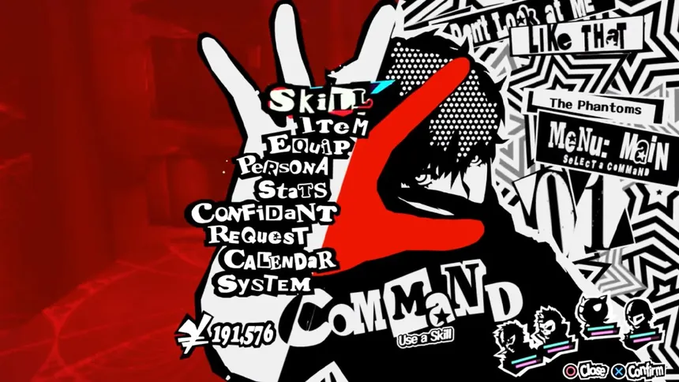 | Menu principal du jeu : lettres découpées façon collage, rouge, noir et blanc. |
| 2 | 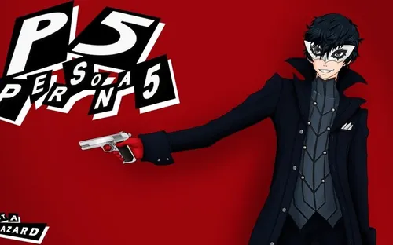 | Logo de Persona 5 en lettres dépareillées, Joker sur fond rouge uni. |
| 3 | 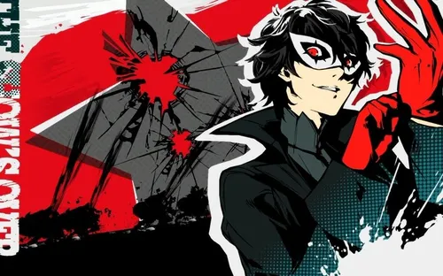 | Joker devant une étoile éclatée, éclaboussures rouges et trame de points. |
| 4 | 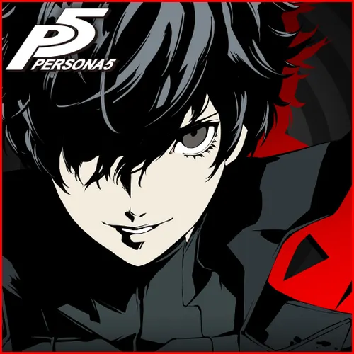 | Portrait de Joker en noir et blanc très contrasté, accents rouges. |

#### All-Out Attack

Portraits des Phantom Thieves (`public/portraits/characters/all-out/`), affichés selon le personnage choisi sur le profil.

| Joker | Panther | Mona | Violet |
| --- | --- | --- | --- |
| 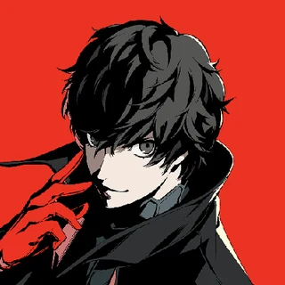 | 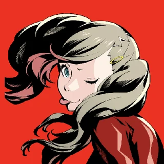 | 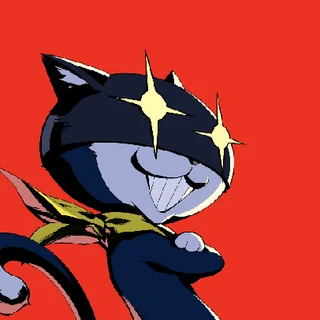 | 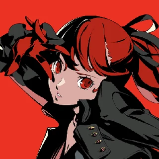 |

#### Mona qui nous parle

Sprites de Mona (`public/portraits/`) utilisés dans les cut-ins pendant la course et sur la page des résultats.

| Fière | Inquiète | Choquée |
| --- | --- | --- |
| 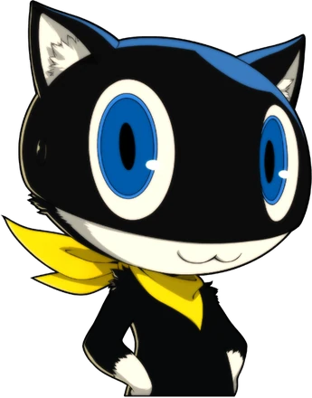 | 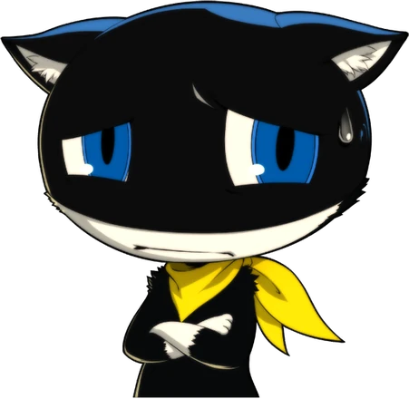 | 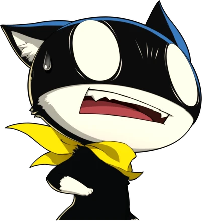 |

### Palette de couleurs

Couleurs définies dans `src/app/globals.css` (détails dans [design-system.md](design-system.md)).

Les couleurs primaires sont vraiment le rouge, noir et blanc. Les main couleurs de Persona 5.

| Rôle | Couleur | Usage |
| --- | --- | --- |
| Rouge signature | `#e60026` | Boutons d'action, mises en évidence, états actifs |
| Noir | `#0e0e10` | Fond des pages, panneaux, ombres |
| Blanc | `#ffffff` | Titres, découpages façon papier |
| Jaune (accent) | `#fde400` | Accents, ruban adhésif, raccourcis clavier |

### Typographies

Chargées avec `next/font` dans `src/app/[locale]/layout.tsx`.

| Police | Usage |
| --- | --- |
| Anton | Grands titres, chiffres, logotype |
| Chivo (700/900) | Libellés, badges, navigation, affichage tête haute |
| Space Grotesk | Texte courant et texte à taper |

### Thème clair et sombre (DES-05)

Je ne sais pas si je vais faire un autre thème personellement dans mon cas parceque ça s'éloignera vraiment trop du style de persona, les thèmes dans le jeu c'est vraiment LA chose qui démarque le jeu. Elle est très facile a différencier des autres et changer les couleurs pour un autre thème éloignerait trop le style du jeu.
